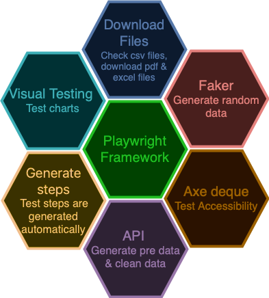

# Framework

The framework use POM (Page Object Model) with components (textArea, buttons, inputText, etc.) to reuse the main functions of the html components and reduce the code needed for each page. 

## Diagram

These are the main parts of the framework:

- [Download files](https://playwright.dev/docs/downloads): Includes functions to download csv, pdf or Excel files
- [Faker](https://fakerjs.dev): To generate random data for the test. 
- [Axe-deque](https://github.com/dequelabs/axe-core-npm/blob/develop/packages/playwright/README.md): Package that offers support for running the axe accessibility testing engine with playwright. 
- [Api](https://playwrightsolutions.com/the-definitive-guide-to-api-testcreating-a-datafactory-to-manage-test-data/): You can use the functions to api calls to generate data as pre-conditions instead of add that with UI and clean up the data
- [Generate steps](https://www.workwithloop.com/blog/a-guide-to-human-readable-reports-in-playwright-with-test-step-expect-annotations): With components and playwright annotations you can auto generate human-readable test
- [Visual testing](https://playwright.dev/docs/test-snapshots): You can use functions to compare screenshots, for example to test charts.  



## Framework structure

This is the main folder structure: 

```
├── api: All apis calls and mock (modify api response with json files) api calls
│   ├── models: interfaces required by api
│   ├── data: json files with custom data
├── components: HTLElements like button, inputTexts, links with general functions
├── docs: contains all documentation
│   ├── images: images for documentation
├── fixtures: setup to connect with lambdatest
├── pages: Contains the elements and common functions for each html page
├── test-results: All accessibility reports will be in this folder
├── tests: Contains all the tests
│   ├── demoRealWorld: Test for demo real world site
│   ├── accessibility.spec.ts: File with accessibility test in other folder to isolate accessibility from E2E tests
├── utils: Contains general functions to add annotations to the tes, api call, visual testing
```
