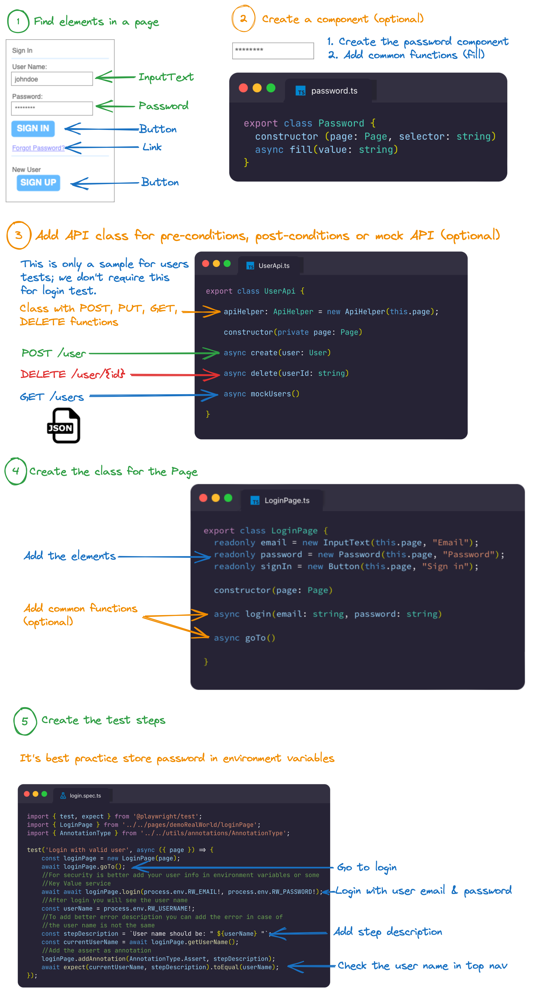
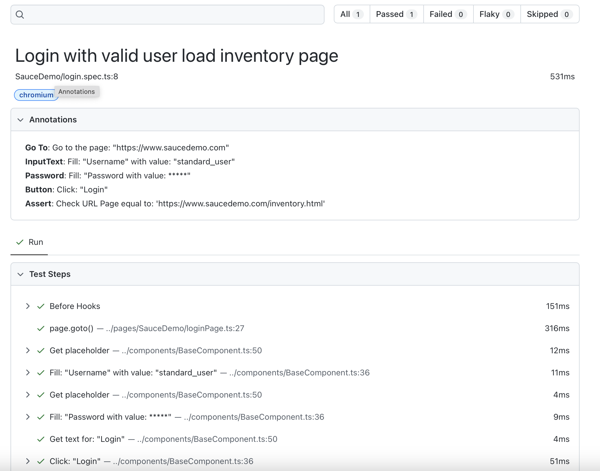

# How to create a test



## Find elements in a page

First you need to find the elements in the page(s) that you want to test. You can select elements by text, id, aria-label, or data-test-id attributes. 

You can use  any of these options:

### Pick locator in VS Code 

Option available in VS Code playwright extension

1. Click in the Pick Locator
2. Go the page in the new browser
3. Select any element
4. Press Enter in VSCode to get the locator into clipboard

//TODO: Add pick locator

### The codegen command

Run the next command that will open 2 browser one with the page and another with the steps. Click in any locator and the code will be generated.
```
npx plawright codegen https://www.saucedemo.com
```
//TODO: Add codegen

### Chrome extension 
You can use some extension to find locators like [letxpath](https://www.youtube.com/watch?v=Oz13qjh1aqE) or [selectorshub](https://www.youtube.com/watch?v=Iqp0qh3Up44)

Too you can check the [Playwright best practices for locators](https://playwright.dev/docs/best-practices#use-locators)

## Add a component (optional)

If you need a new component you need to find the most common functions for the component, and add a new class with that functions. If is a component that be replaced with similar components. For example some pages use a table an others a grid you can use an interface to use the same functions for any kind of grid or table.

1. Create a new Password class that extends from the BaseComponent (this class contains common functions to all components)
2. Create the common functions for the component. For password is fill and be will replace the value with *** in the
autogenerated steps

```typescript
import { Page } from '@playwright/test';
import { BaseComponent } from './baseComponent';
import { AnnotationHelper } from '../utils/annotations/AnnotationHelper';

export class Password extends BaseComponent {

    /**
     * Constructor
     * @param page Playwright page
     * @param annotationHelper annotation helper
     * @param placeholder placeholder
     */
    constructor(page: Page, annotationHelper: AnnotationHelper, private placeholder: string) {
        super(page, annotationHelper);
        this.locator = this.page.getByPlaceholder(placeholder);
    }

    /**
     * Fill the password
     * @param value Password to fill
     */
    async fill(value: string) {
        const stepDescription = `Fill ${this.placeholder}: ******`;
        await this.addStepWithAnnotation(stepDescription, async () => {
            await this.locator.fill(value);
        });
    }

}
```

## Create the API for pre-conditions or post-conditions (otpional)

Some pages are using API to insert, update, delete or get data. If you need some pre-conditions to setup some data, like the next sample for edit an article test.

You can check the API in the page inspecting the network tab in the developer tools in any browser and clicking in the elements. Too you can ask the developers about api documentation that could be in swagger or some postman collections to get the knowledge of the apis.

TODO: Inspect API calls in network


For example for tests that edit or delete an article you can add the article by api and after edit delete the article with api due to the test is only testing the edit option. The functions needed are: 

1. Add api to create an article 
2. Add the steps to edit the article created in the api
3. Instead of return all articles return one article from a json file (mock) 
4. Delete the created article by api

In the code you need: 

1. Create a articleApi.ts file with the post, delete and mock functions.
2. Create a model class for the user post api in model folder with the name article.ts. You can use a [page to convert from json to a ts class](https://transform.tools/json-to-typescript). 
3. If is needed to create the json to mock in data.ts folder.

You can check the next links to get more samples:

[How low-level API calls can stabilize your end-to-end tests - javascript](https://www.checklyhq.com/blog/how-low-level-api-calls-stabilize-your-end-to-end-tests/)
[The Definitive Guide to API Test Automation With Playwright: Introduction](https://playwrightsolutions.com/is-it-possible-to-do-api-testing-with-playwright-the-definitive/)

## Create the Page Object Model

Page Object Model is a design pattern in testing that creates a class for any page with all the elements and common functions that can be reused for other tests. All pages extend from BasePage that include common functions to all pages.

1. Create the page class with the name of the page + Page. Example: loginPage.ts
2. Add the components

```typescript
export class LoginPage extends BasePage {
    readonly email = new InputText(this.page, this.annotationHelper, 'Email');
    readonly password = new Password(this.page, this.annotationHelper, 'Password');
    readonly signIn = new Button(this.page, this.annotationHelper, 'Sign in');
}
```

3. Add the common functions to the page (optional). 

We need a function to go to login page

```typescript 
/**
 * Go to sign in (Click in Sign in top menu)
 */
async goTo(): Promise<void> {
    const stepDescription = 'Go to Sign in';
    await test.step(stepDescription, async () => {
        await this.goToDefault();
        //This is a function in BasePage due to all pages have the nav link
        await this.goToNavLink('Sign in');
    });
}
```

For login you can reuse the login in different test ()

```typescript 
/**
 * Fill and submit login form
 * @param email User email
 * @param password Password email
 */
async login(email: string, password: string) {
    await this.email.fill(email);
    await this.password.fill(password);
    await this.signIn.click();
}
```

In general all expect are in the test, but you add some common or complex expects in the page class.

## Create the test

Create the test with the name of the group of test + .spec + .ts. For login is login.spec.ts

First you need to add the imports 

```typescript 
import { test, expect } from '@playwright/test';
import { LoginPage } from '../../pages/demoRealWorld/loginPage';
```

After you need to add the step with a description about the test case

```typescript 
test('Login with valid user', async ({ page }) => {
```

Add the steps. The scenario would be:

1. Go to login page
2. Fill the user email and password. For security, you shouldn't store usernames and passwords in code, you can use environment variables or third party services to store and retrieve passwords like azure key vault.
3. To check that the login is correct you will see the username in the top nav bar. The function that returns the username is in base page.

```typescript 
const loginPage = new LoginPage(page);
// Go to login page
await loginPage.goTo();
//For security is better add your user info in environment variables or some Key Value service 
// Fill the user email and password
await await loginPage.login(process.env.RW_EMAIL!, process.env.RW_PASSWORD!);
//After login you will see the user name
const userName = process.env.RW_USERNAME!;
//To add better error description you can add the error message in case of the user name is not the same
const stepDescription = 'User name should be:' + userName;
const currentUserName = await loginPage.getUserName();
await expect(currentUserName, stepDescription).toEqual(userName);
```
 

