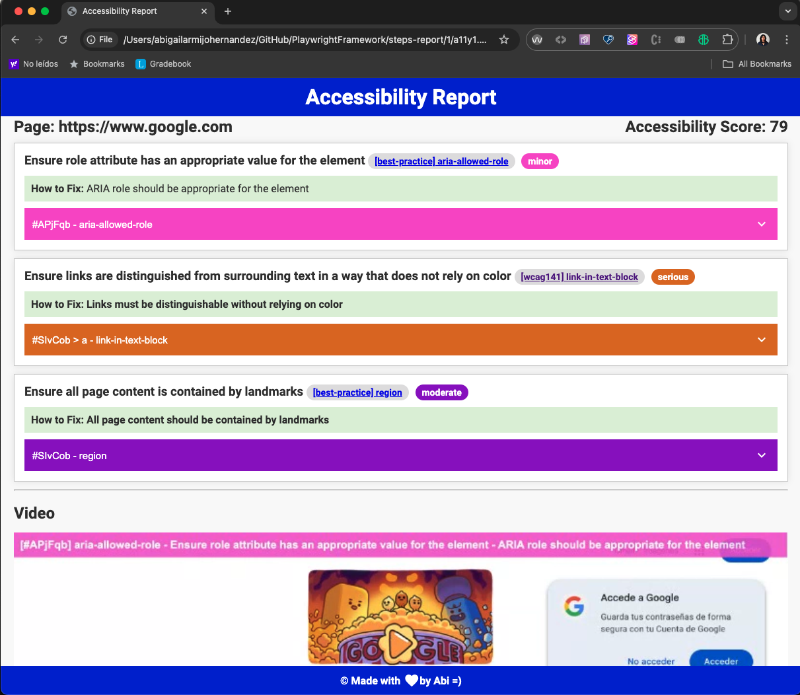

# Accessibility tool

It's essential and is the law in some countries that your website is accessible to all people without discriminating against disabled people, for example, deaf or blind.

Although accessibility testing requires manual testing, this tool can help to:

- Finds the bugs with @axe-core/playwright.

# Run tests

To run accessibility test:

```
PAGE_URL= Page to test example: "https://www.google.com"
```

# Report



https://github.com/user-attachments/assets/79c2a52c-d6a0-4b3d-a5c6-ceeb521daa54

&nbsp;

## Articles

[Tools for accessibility testing](https://abigailarmijo.substack.com/p/tools-for-accessibility-testing)
