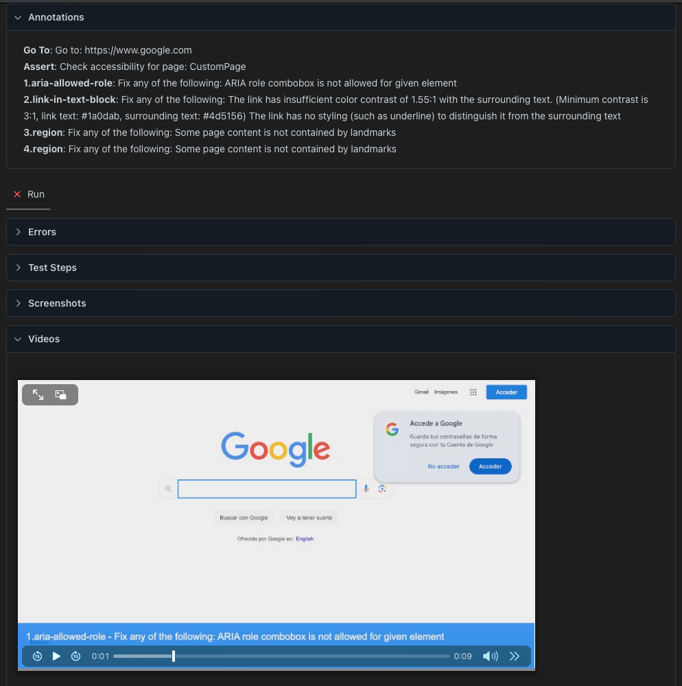
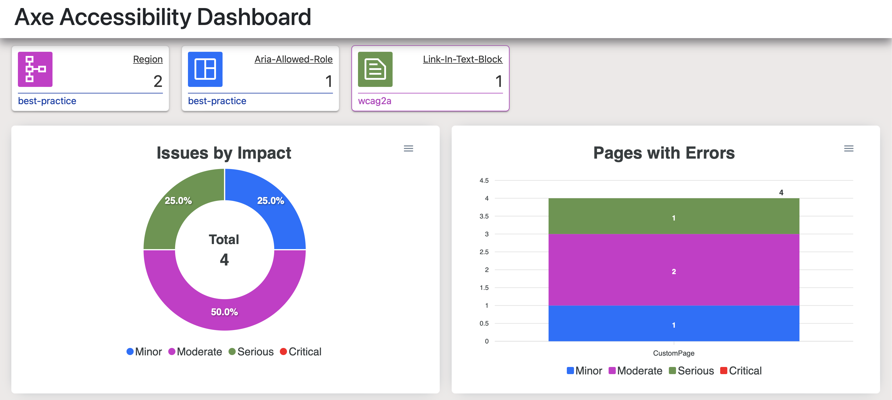
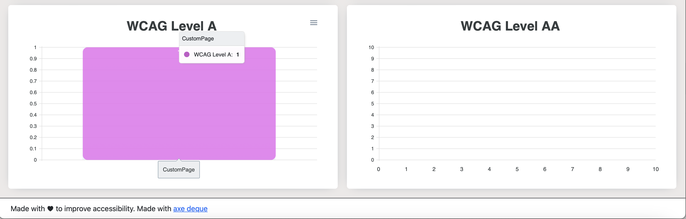
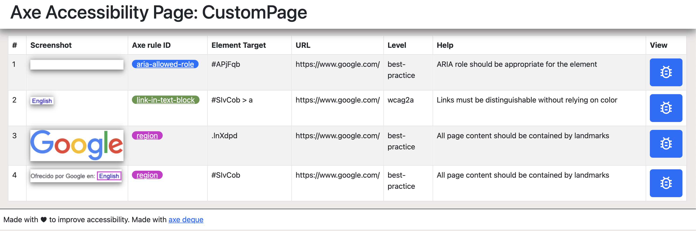
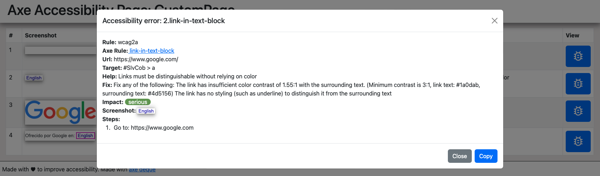
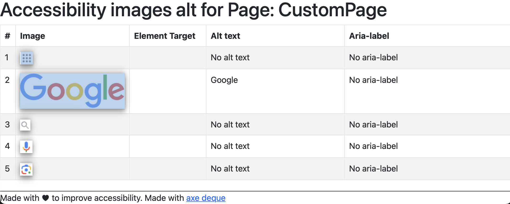
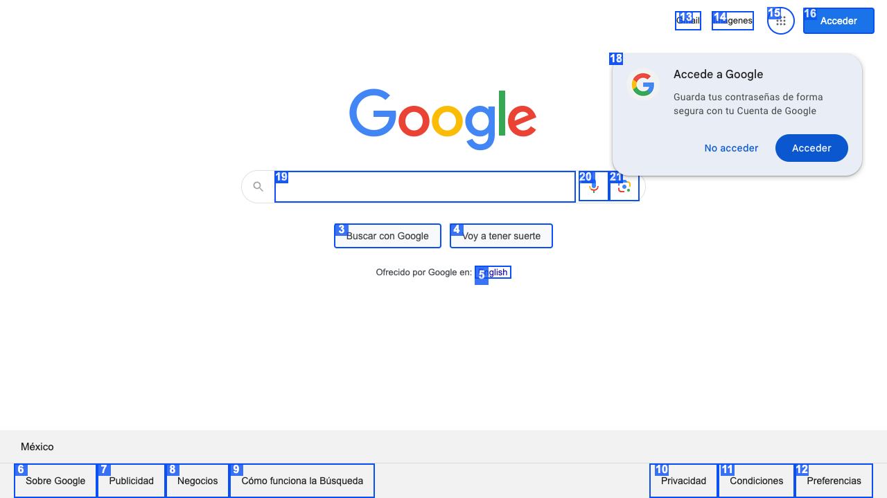

# Accessibility tool

It's essential and is the law in some countries that your website is accessible to all people without discriminating against disabled people, for example, deaf or blind.

Although accessibility testing requires manual testing, this tool can help to:

- Finds the bugs with @axe-core/playwright.
- Shows a dashboard with the summary of the errors by WCAG level.
- Summary of errors by page with an option to copy bugs.
- Summary of error by WCAG rule with an option to copy bugs.
- Summary of alternative texts.
- POC of visual tab order testing.
- Video that highlights the elements with accessibility bugs and footer text to explain the bug.

# Run tests

To run accessibility test:

```
PAGE_URL= Page to test example: "https://www.google.com"
DEBUG_PAUSE=2000 Milliseconds to highlight elements with accessibility issues.
```

Dashboard and summaries will be stored in test-results folder









## Articles

[Tools for accessibility testing](https://abigailarmijo.substack.com/p/tools-for-accessibility-testing)
