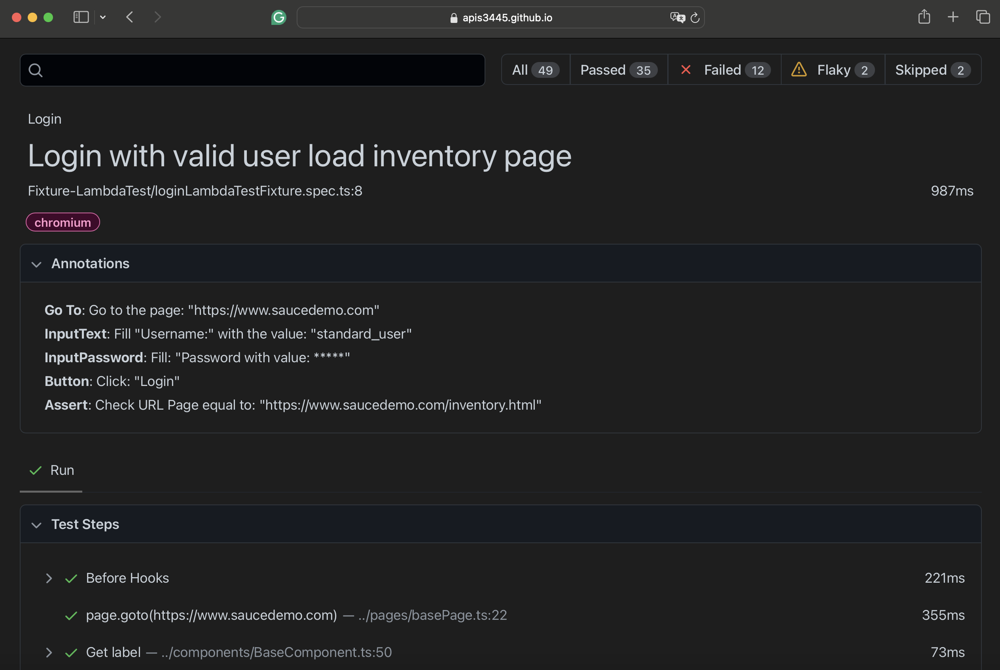

# Basic

Includes:

- A login sample test with Page Object Model with component model.
- A test that reuses authenticated state for different user roles with global setup

## Components in Page Object Model

The component is more useful for more complex components like tables or grids to reuse some basic functions for example to get the headers or total of rows. I've worked with different migrations in the UI for example Webforms to Angular and with this component, I only need to change the component from Webforms table to a new angular component for the table.

Too I am generating annotations in each component to auto-generate test steps

This component model is used by:

[Atata Framework](https://atata.io)

## Articles

You can see my articles to explain:

[How to reuse authenticated state with playwright](https://abigailarmijo.substack.com/p/how-to-reuse-authenticated-state)
[How to design a testing framework](https://abigailarmijo.substack.com/p/how-to-design-a-testing-framework)
